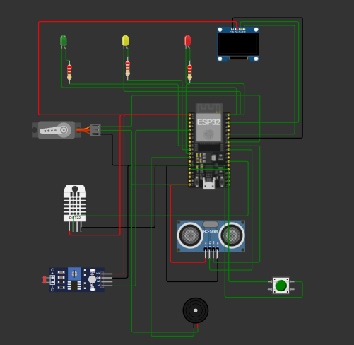

# CraneGuard

An IoT-based Smart Crane Safety and Obstacle Detection System developed using the ESP32 microcontroller. CraneGuard improves operational safety by detecting nearby obstacles in real time and providing visual, audible, and mechanical alerts to help prevent crane collisions.

> **Project Status:** Developed and tested using the Wokwi simulator.

---

## Overview

CraneGuard is designed to enhance construction site safety by continuously monitoring the surroundings of a crane. The system measures the distance to nearby objects using an ultrasonic sensor and warns the operator through LEDs, an OLED display, and a buzzer. A servo motor can also simulate automatic movement restriction when an obstacle enters the danger zone.

---

## Features

- Real-time obstacle detection
- Three-level safety indication
- OLED display for live distance monitoring
- LED status indicators
- Audible buzzer warning
- Servo-based safety response
- ESP32 microcontroller
- Fully simulated using Wokwi

---

## Components Used

- ESP32 Dev Module
- HC-SR04 Ultrasonic Sensor
- SSD1306 OLED Display
- SG90 Servo Motor
- LEDs
- Resistors
- DHT22 Sensor
- Jumper Wires

---

## Working Principle

1. The ultrasonic sensor continuously measures the distance to nearby objects.
2. The ESP32 processes the sensor readings.
3. The OLED displays the measured distance.
4. LEDs indicate the safety level.
5. The buzzer activates when an object enters the danger zone.
6. The servo simulates restricting crane movement to prevent collisions.

---

## Safety Levels

| Distance | Status |
|----------|--------|
| Greater than 100 cm | Safe |
| 50–100 cm | Warning |
| Less than 50 cm | Danger |

---

## Circuit Diagram



---

## Software Used

- Arduino IDE
- Wokwi Simulator
- GitHub

---

## Repository Structure

```
CraneGuard/
│── CraneGuardX.ino
│── README.md
│── LICENSE
└── diagram.png
```

---

##  Future Improvements

- Multiple ultrasonic sensors
- IoT dashboard for remote monitoring
- Mobile application integration
- Camera-based obstacle detection
- Load monitoring system
- GPS and GSM integration
- Data logging and analytics

---

## Author

**Gayathri J Pisharady**

Mechanical Engineering Student  
Government Engineering College Palakkad

---

## 📄 License

This project is licensed under the MIT License.
